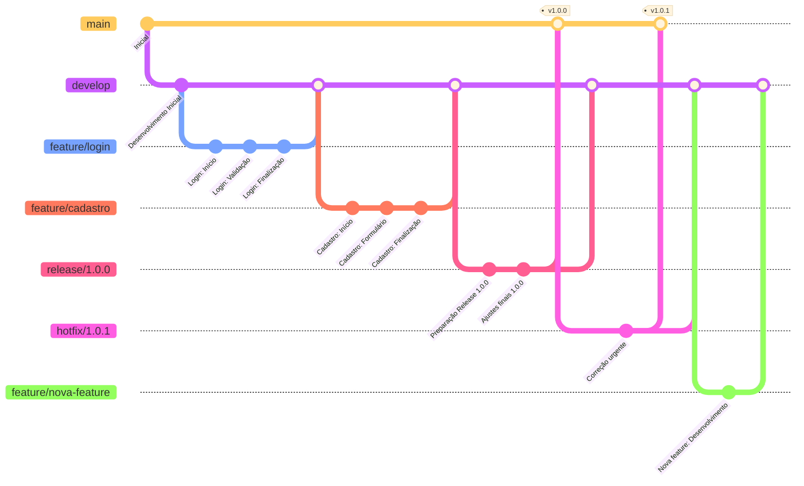

# Diagrama de Gitflow

O diagrama abaixo ilustra o fluxo de trabalho Gitflow implementado neste projeto:

## Explicação do Fluxo

1. Desenvolvimento começa na branch `develop`
2. Features são criadas a partir da `develop` (ex: `feature/login`, `feature/cadastro`)
3. Quando features são concluídas, são mergeadas de volta para `develop`
4. Quando `develop` tem features suficientes para um release, cria-se uma branch `release/x.y.z`
5. A branch de release é finalizada com merge para `main` (com tag) e para `develop`
6. Se um bug crítico for encontrado em produção, cria-se um `hotfix/x.y.z` a partir da `main`
7. O hotfix é mergeado para `main` (com tag) e para `develop` 